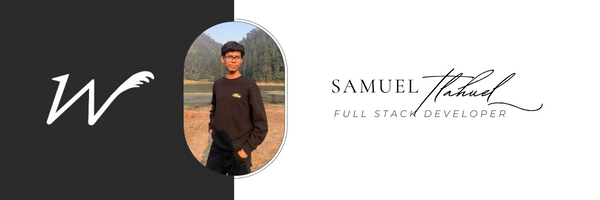

#  Hi, I'm Samuel Tlahuel

  

### 👨‍💻 About Me
*   **Education**: 5th-grade professional studying **Systems Engineering**.
*   **Role**: Lead Engineering capacity focusing on server architecture and development.

---

### 🚀 Featured Projects
*   **[Feedgames](https://feedgames.vercel.app)**: A gamer-centric social platform built with **NextJS**, **ExpressJS**, and **SupabaseJS**. Features Riot API integration for Valorant stats and a Threads-inspired UI.
*   **Zync**: An enterprise automation system for HR and Accounting, featuring complex inventory management and massive file processing modules.
* **Sentinel SDK**:  A TypeScript package that allows any messaging platform to detect, in real time, recruitment patterns by organized crime.

---

### 🛠 Languages and Tools

---

### 📫 Connect with me

  

